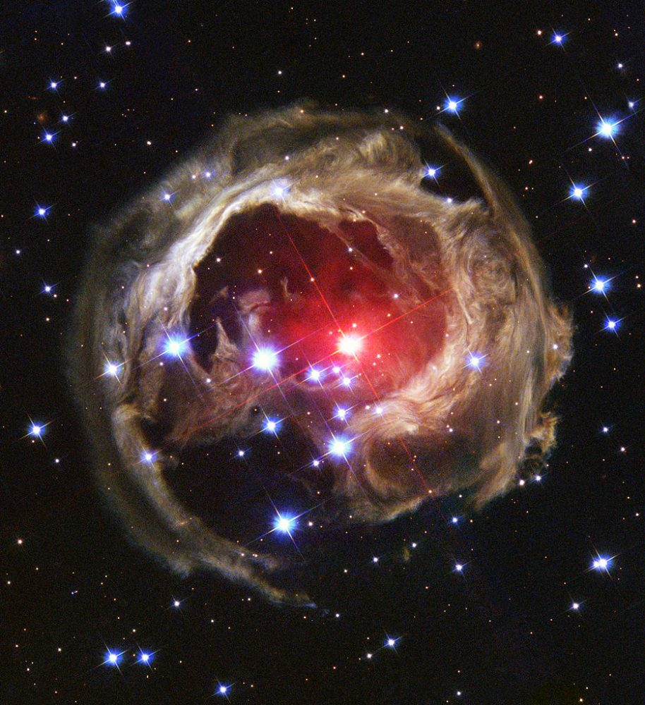
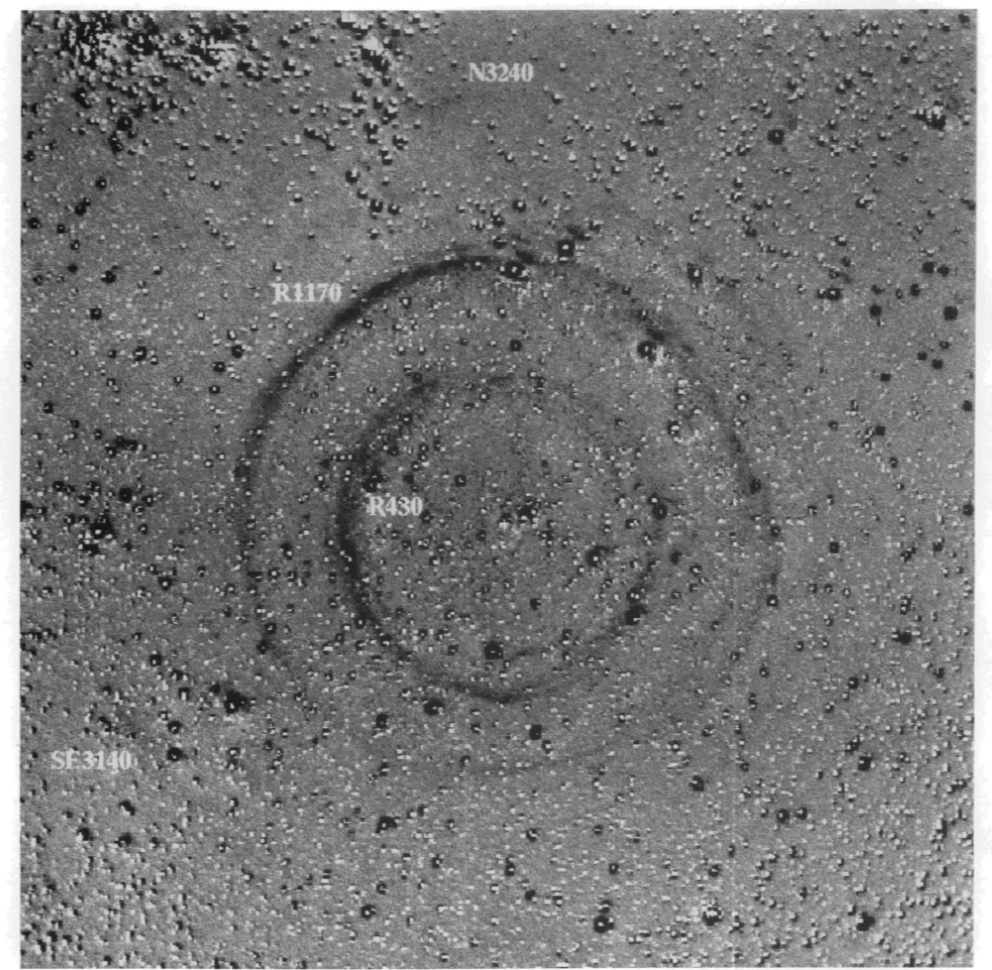

# Xiaolong - Week of 08/30/2019

## 1. Papers and code

### 1.1 Papers Read

I read some papers about light echos. 

- [Reflections on reflexions: Light echoes in type Ia SN](https://academic.oup.com/mnras/article/357/4/1161/1051008): This article gives a introduction of LE phenomenon and a MC implementation of 3d scattering.  

- [V838 Monocerotis](https://www.nature.com/articles/nature01508): This paper present the observation of a light echo from a variable star V838 Mon. 
- [SN 1987](https://iopscience.iop.org/article/10.1088/0004-637X/767/1/45): This paper report the first light echo observed from a supernova supernova SN1987A. 
- [SNR 0509-67.5](https://arxiv.org/pdf/0801.4762.pdf)
- [Tycho’s 1572 supernova](https://www.nature.com/articles/nature07608)
- [SN 2007af]()
- [SN 2003gb](https://iopscience.iop.org/article/10.1086/497578/meta)
- [SN 1991T](https://iopscience.iop.org/article/10.1086/307766)
- [Eta Carinae]()
### 1.2 Code Written

: A simple implementation of GANs using keras. GAN is a unsupervised learning method that can be used to generate similar samples from datasets. Trained by enough data, it is possible to apply GANs to detect light echos. 

## 2. Figures

Figure 1.  The light echo around variable star V838 Monocerotis observed by the Hubble Space Telescope. 

Figure 2. The light echo from  supernova SN1987A. 

## 3. Results

I read several papers about light echos. Light echos are produced when the light of a rapidly brightening object, like a supernova, is reflected by interstellar dust. The reflected light may arrive at the observer much later then the source of the light. Therefore we can use light echo  to study historical supernova. Light echos are usually ten times fainter than their original sources thus hard to detect. But with the ability of LSST, we will detect more light echos from many other sources in years ahead. 