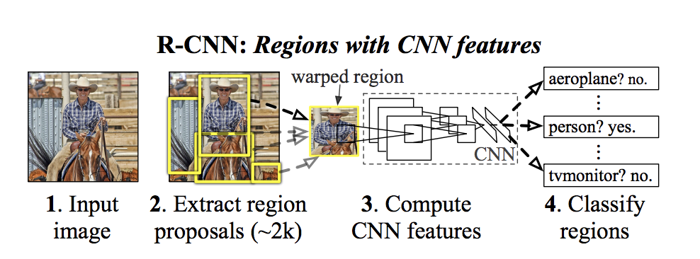

# Xiaolong - Week of  09/13/2019

## 1. Papers and code

### 1.1 Papers Read

[Rich feature hierarchies for accurate object detection and semantic segmentation](https://arxiv.org/abs/1311.2524): This paper introduced the R-CNN, an algorithm for object detection. R-CNN first generates some region proposals then apply CNN to classify each region. 

### 1.2 Code Written

[phspaceMetric.ipynb](source/phspaceMetric.ipynb): I am trying to implement the metric to evaluate the observations in parameter space, defined by color, magnitude, and time gaps between two visits. 

## 2. Figures

Figure 1: R-CNN object detection system: (1). takes an input image, (2). extracts around 2k region proposals, (3). computes features for each region using CNN and (4). classifies each region.

## 3. Results

I learned an object detection method, R-CNN, which first apply the selective search algorithm to extract region proposals and next use CNN to classify objects in each region. The problem with R-CNN is that it takes huge amount of time to train. This drawback is solved by Fast R-CNN and Faster R-CNN, which make possible the real time detection. R-CNN may be used to detect light echoes regardless their sizes inside a field. 