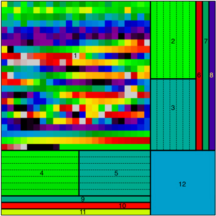

# Xiaolong - Week of  10/11/2019

## 1. Papers and code

### 1.1 Papers Read

[ExtraGan](https://iopscience.iop.org/article/10.3847/1538-3881/aae77c): This article applies GANs to atmospheric retrievals on exoplanets. ExoGAN is able to recognize molecular features, atmospheric trace-gas abundances and planetary parameters.

[Semantic Image Inpaiting with Deep Generative Models](https://arxiv.org/abs/1607.07539): The image inpainting algorithm used in ExoGan.

### 1.2 Code Written

[tvs_hack.ipynb](hackathon/tvs_hack.ipynb): some utils for TVS hackathon project. 

## 2. Figures

 

Figure 1. The Atmospheric Spectra and Parameters Array (ASPA). Each area is dedicated to a particular atmoshperic characteristic. 

Figure 2. The  ASPA is masked,  leaving Hubble/WFC3 wavelengths only and ExoGAN tries to complete the ASPA. 

## 3. Results

I read an article about ExoGAN, which applies GANs to the spectra of exoplanetary. The parameters are arranged as an Atmospheric Spectra and Parameters Array. Giving only Hubble/WFC3 wavelengths,  the ExaGAN is trying to complete the whole image. ExaGAN provides a different approach to atmospheric retrievals than Bayesian sampling methods and may be applied to other science cases. 